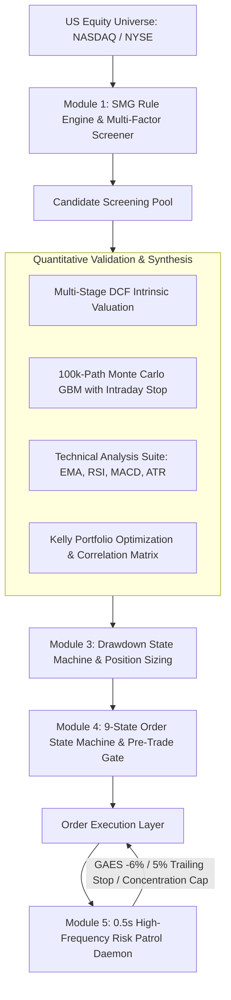

# SMG Quantitative Trading System (Stock Market Game)

[](https://www.python.org/)
[]()
[]()

A financial-grade automated quantitative trading and risk management system designed for **The Stock Market Game (SMG)**. Features multi-factor screening, multi-model quantitative synthesis (DCF, 100k-path Monte Carlo VaR, Technical Indicators, Kelly portfolio optimization), dynamic drawdown state machines, and a 0.5s real-time risk patrol daemon with trailing stops.

---

## 🏛️ System Architecture



---

## 🧮 Core Models & Mathematical Formulations

### 1. Multi-Stage Discounted Free Cash Flow (DCF)
- **Cost of Capital (WACC)** via CAPM:
  $$\\text{WACC} = R_f + \\beta \\times \\text{ERP}$$
  *(Defaults: $R_f = 4.75\\%$, $\\text{ERP} = 5.5\\%$, clamped to $[6\\%, 15\\%]$)*
- **Two-Stage Cash Flow Present Value**:
  $$\\text{PV} = \\sum_{t=1}^{5} \\frac{\\text{FCF}_0 \\cdot (1+g_1)^t}{(1+\\text{WACC})^t} + \\frac{\\text{FCF}_5 \\cdot (1+g_{\\text{term}})}{(\\text{WACC} - g_{\\text{term}})(1+\\text{WACC})^5}$$
- **Margin of Safety (MoS)**:
  $$\\text{MoS} = \\frac{\\text{Fair Value} - \\text{Market Price}}{\\text{Fair Value}}$$

### 2. Geometric Brownian Motion (GBM) Monte Carlo Simulation
- **Stochastic Path Generation** (Vectorized across 100,000 paths):
  $$\\ln S_t = \\ln S_0 + \\sum_{k=1}^t \\left( \\mu_d - \\frac{1}{2}\\sigma_d^2 + \\sigma_d Z_k \\right), \\quad Z_k \\sim \\mathcal{N}(0, 1)$$
- **Intraday Stop-Loss Truncation**: Any path breaching $\\le -6.0\\%$ at any point within the horizon is stopped immediately at $-6.0\\%$, computing true $P(\\text{Stop})$ and conditional expected return $E[R]$.

### 3. Kelly Criterion & Correlation Control
- **Optimal Sizing Fraction**:
  $$f^* = p - \\frac{1-p}{b}$$
  where $p$ is empirical win probability and $b = \\frac{\\text{Avg Gain}}{\\text{Avg Loss}}$. Clamped at $40\\%$.
- **Cluster Isolation**: Computes pairwise Pearson correlation over log returns; asset pairs with $r > 0.70$ are clustered to prevent systematic drawdown resonance.

### 4. High-Frequency Trailing Stop & Risk Defense
- **5.0% Trailing Stop Loss**: Monitored against persistent High-Water Mark (HWM):
  $$\\text{Drawdown}_{\\text{peak}} = \\frac{P_{\\text{max}} - P_t}{P_{\\text{max}}} \\ge 5.0\\% \\quad \\text{and} \\quad P_{\\text{max}} > \\text{Cost}$$
- **GAES -6.0% Hard Disaster Floor**: Unconditional market liquidation if $P_t \\le \\text{Cost} \\times 0.94$.
- **Concentration Exact Reduction**: When an asset exceeds $20\\%$ total equity, trims exact shares down to $17.5\\%$ safety target:
  $$\\text{Shares to Sell} = \\left\\lfloor \\frac{\\text{Position Value} - (\\text{Equity} \\times 0.175)}{P_t} \\right\\rfloor + 1$$
- **Momentum Anti-Whipsaw Time Lock**: Restricts opening momentum trades until after 07:15 PT to bypass market open noise, with a strict 2-buy daily circuit breaker.

---

## 📁 Repository Structure

```
.
├── config/
│   └── example_snapshot.json       # Sanitized sample portfolio & market input
├── src/
│   └── smg_strategy/
│       ├── __init__.py
│       ├── models.py               # Immutable domain records (dataclasses)
│       ├── rules.py                # Official SMG eligibility & rule constraints
│       ├── scoring.py              # Multi-factor long/short scoring formulas
│       ├── risk.py                 # Drawdown state machine & sizing limits
│       ├── report.py               # Markdown review packet renderer
│       ├── scanner.py              # Dynamic market screener with yfinance
│       ├── quant_engine.py         # Chief Quant 4-model validation engine
│       ├── risk_patrol.py          # 0.5s real-time risk patrol daemon
│       ├── order_state_machine.py  # 9-state order state machine & risk gates
│       ├── ticker_locks.py         # Daily idempotent trade locks
│       └── pre_market_gate.py      # Pre-market broker reconciliation gate
├── tests/
│   ├── test_models.py
│   ├── test_rules.py
│   ├── test_scoring.py
│   ├── test_risk.py
│   └── test_report.py
├── strategy_cli.py                 # CLI entrypoint for report generation
└── README.md
```

---

## 🚀 Getting Started

### 1. Requirements
- Python 3.10+
- `numpy`, `scipy`, `pandas`, `yfinance`

```bash
pip install numpy scipy pandas yfinance
```

### 2. Run the Unit Test Suite
```bash
PYTHONPATH=src python3 -m unittest discover -s tests -v
```

### 3. Generate Strategy Review Packet
```bash
PYTHONPATH=src python3 strategy_cli.py config/example_snapshot.json --output latest_report.md
```

### 4. Run Chief Quant 4-Model Validation Engine
```bash
PYTHONPATH=src python3 src/smg_strategy/quant_engine.py
```

### 5. Run High-Frequency Risk Patrol Daemon
```bash
PYTHONPATH=src python3 src/smg_strategy/risk_patrol.py
```

---

## ⚖️ Disclaimer

This codebase is developed strictly for educational purposes within the virtual simulation of **The Stock Market Game (SMG)**. It does not constitute financial, investment, or legal advice.
