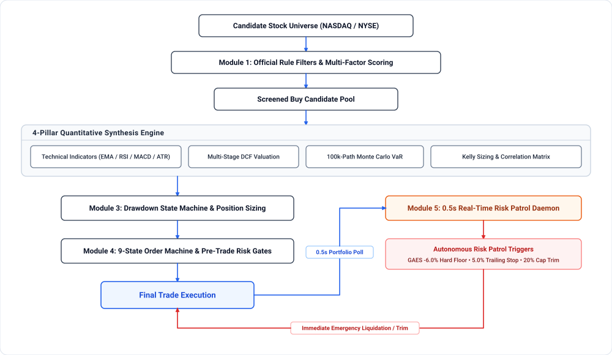

# SMG Quantitative Trading System (Stock Market Game)

[](https://www.python.org/)
[]()
[]()

A financial-grade automated quantitative trading, risk management, and historical backtesting system designed for **The Stock Market Game (SMG)**. Features multi-factor screening, 4-pillar quantitative synthesis (DCF with dynamic WACC, Broadie-Glasserman-Kou discrete-barrier corrected 100k-path Monte Carlo VaR, Union-Find correlation clustering, Kelly portfolio optimization), dynamic drawdown state machines, a 0.5s real-time risk patrol daemon, and a full Point-in-Time historical backtesting engine with SPY benchmark comparison.

---

<p align="center">
  
</p>

---

## 🧮 Core Models & Mathematical Formulations

### 1. Multi-Stage Discounted Free Cash Flow (DCF) with Capital Structure WACC
- **Dynamic WACC Calculation**:
  $$\text{WACC} = w_e \cdot (R_f + \beta \times \text{ERP}) + w_d \cdot K_d \cdot (1 - T_c)$$
  where $w_e = \frac{E}{E+D}$, $w_d = \frac{D}{E+D}$, $K_d$ is pretax cost of debt (5.25%), $T_c$ is corporate tax rate (21%), $R_f = 4.75\%$, and $\text{ERP} = 5.5\%$, bounded within $[6\%, 15\%]$.
- **Two-Stage Cash Flow Present Value**:
  $$\text{PV} = \sum_{t=1}^{5} \frac{\text{FCF}_0 \cdot (1+g_1)^t}{(1+\text{WACC})^t} + \frac{\text{FCF}_5 \cdot (1+g_{\text{term}})}{(\text{WACC} - g_{\text{term}})(1+\text{WACC})^5}$$
- **Per-Share Fair Value & Margin of Safety (MoS)**:
  $$\text{Fair Value} = \frac{\text{PV} - \text{Total Debt} + \text{Cash}}{\text{Shares Outstanding}}, \quad \text{MoS} = \frac{\text{Fair Value} - \text{Market Price}}{\text{Fair Value}}$$

### 2. Broadie-Glasserman-Kou (BGK) Barrier-Corrected Monte Carlo Simulation
- **Geometric Brownian Motion (GBM) Paths**:
  $$\ln S_{t+\Delta t} = \ln S_t + \left( \mu - \frac{1}{2}\sigma^2 \right)\Delta t + \sigma \sqrt{\Delta t} Z, \quad Z \sim \mathcal{N}(0, 1)$$
- **Discrete Barrier Boundary Shift** (Broadie, Glasserman & Kou, 1997):
  To eliminate the ~6.37% systematic underestimation of intraday stop-loss breach caused by daily closing discrete observation, the effective barrier is shifted outward:
  $$\text{Effective Stop} = (1 + \text{Nominal Stop}) \cdot \exp\left( -\frac{\zeta(1/2)}{\sqrt{2\pi}} \cdot \sigma_{\text{step}} \right) - 1 \approx (1 + \text{Nominal Stop}) \cdot \exp(0.5826 \cdot \sigma_{\text{step}}) - 1$$
  Simulated with $M=4$ sub-steps per trading day to closely replicate continuous barrier crossings.

### 3. Kelly Criterion & Union-Find Transitive Correlation Clustering
- **Optimal Sizing Fraction**:
  $$f^* = p - \frac{1-p}{b}$$
  where $p$ is empirical win probability and $b = \frac{\text{Avg Gain}}{\text{Avg Loss}}$. Half-Kelly allocation is applied with hard concentration ceilings.
- **Concentration Hard Guard**: If an existing position is already $\ge 20\%$ of portfolio equity, new allocations are strictly blocked ($0$ shares), guaranteeing adherence to the SMG 20% limit.
- **Union-Find Transitive Clustering**: Computes the pairwise Pearson correlation matrix $R$ over daily log returns. Disjoint-Set Union (Union-Find) is employed to compute the true transitive connected components:
  $$\text{If } \text{Corr}(A, B) > 0.70 \text{ and } \text{Corr}(B, C) > 0.70 \implies \{A, B, C\} \in \text{Same Risk Cluster}$$

### 4. High-Frequency Trailing Stop & Risk Defense Daemon
- **5.0% Trailing Stop Loss**: Monitored against persistent disk-backed High-Water Mark (HWM):
  $$\text{Drawdown}_{\text{peak}} = \frac{P_{\text{max}} - P_t}{P_{\text{max}}} \ge 5.0\% \quad \text{and} \quad P_{\text{max}} > \text{Cost}$$
- **GAES -6.0% Hard Disaster Floor**: Unconditional market liquidation if $P_t \le \text{Cost} \times 0.94$.
- **Concentration Exact Reduction**: When an asset exceeds $20\%$ total equity, trims exact shares down to $17.5\%$ safety target:
  $$\text{Shares to Sell} = \left\lfloor \frac{\text{Position Value} - (\text{Equity} \times 0.175)}{P_t} \right\rfloor + 1$$
- **30-Second TTL Market Cache**: Prevents API rate-limiting under high-frequency 0.5s patrol daemon loops.
- **Momentum Anti-Whipsaw Time Lock**: Restricts opening momentum trades until after 07:15 PT to bypass market open noise, with a strict 2-buy daily circuit breaker.

---

## 📁 Repository Structure

```
.
├── assets/
│   ├── system_architecture.svg       # Lossless vector architecture diagram
│   └── system_architecture.png       # 3x Retina Ultra-HD architecture diagram (2760x1680)
├── config/
│   └── example_snapshot.json         # Sanitized sample portfolio & market input
├── src/
│   └── smg_strategy/
│       ├── __init__.py
│       ├── config.py                 # Centralized parameter & threshold governance
│       ├── models.py                 # Immutable domain records (dataclasses)
│       ├── rules.py                  # Official SMG eligibility & rule constraints
│       ├── scoring.py                # Multi-factor long/short scoring formulas
│       ├── risk.py                   # Drawdown state machine & sizing limits
│       ├── report.py                 # Markdown review packet renderer
│       ├── scanner.py                # Dynamic market screener with yfinance
│       ├── quant_engine.py           # Chief Quant 4-model validation engine (BGK, Kelly, DCF, UF)
│       ├── hourly_quant_decision.py  # Hourly automated quant portfolio decision generator
│       ├── risk_patrol.py            # 0.5s real-time risk patrol daemon (HWM trailing stops)
│       ├── backtest.py               # Point-in-Time backtesting engine with SPY benchmark
│       ├── order_state_machine.py    # 9-state order state machine & risk gates
│       ├── ticker_locks.py           # Daily idempotent trade locks
│       └── pre_market_gate.py        # Pre-market broker reconciliation gate with audit trails
├── tests/
│   ├── test_models.py
│   ├── test_rules.py
│   ├── test_scoring.py
│   ├── test_risk.py
│   ├── test_report.py
│   ├── test_quant_fixes.py           # Unit tests for Kelly caps, Union-Find, BGK Monte Carlo, DCF
│   └── test_backtest.py              # Unit tests for backtest engine and performance metrics
├── strategy_cli.py                   # Unified CLI: review packet generation & historical backtesting
└── README.md
```

---

## 🚀 Getting Started

### 1. Requirements
- Python 3.10+
- `numpy`, `scipy`, `pandas`, `yfinance`

```bash
pip install numpy scipy pandas yfinance
```

### 2. Run the Comprehensive Unit Test Suite
```bash
PYTHONPATH=src python3 -m unittest discover -s tests -v
# Output: Ran 39 tests in 0.142s ... OK
```

### 3. Run Historical Point-in-Time Backtesting
Test quantitative strategies against historical data with automated SPY benchmark comparison, next-day open execution ($t+1$ Open), and ASCII equity curves:

```bash
# Quick backtest on top tech leaders
PYTHONPATH=src python3 strategy_cli.py --backtest --tickers "AAPL,NVDA,MSFT,AMZN" --start "2024-01-01" --end "2024-06-30"

# Backtest with JSON output export
PYTHONPATH=src python3 strategy_cli.py --backtest --tickers "AAPL,NVDA,GOOGL" --start "2024-01-01" --end "2024-04-01" --json-output backtest_results.json
```

**Key Backtest Capabilities & Performance Metrics**:
- **Point-in-Time Execution**: Eliminates lookahead bias by scoring on day $t$ close and filling orders at day $t+1$ Open with slippage.
- **Realistic Slippage & Gap-Down Stops**: Factors in overnight gap-down risks (`min(target_stop, open)`).
- **Walk-Forward Overfitting Analysis**: Built-in `run_walk_forward()` utility splits historical regimes to measure out-of-sample decay.
- **Metrics Reported**: Excess Return vs SPY, Total Return, CAGR, Annualized Volatility, Sharpe Ratio ($R_f = 4.75\%$), Maximum Drawdown, Calmar Ratio, Jensen's Alpha, Beta, Win Rate, and Profit Factor.

### 4. Generate Strategy Review Packet
```bash
PYTHONPATH=src python3 strategy_cli.py config/example_snapshot.json --output latest_report.md
```

### 5. Run Chief Quant 4-Model Validation Engine
```bash
PYTHONPATH=src python3 src/smg_strategy/quant_engine.py
```

### 6. Run High-Frequency Risk Patrol Daemon
```bash
PYTHONPATH=src python3 src/smg_strategy/risk_patrol.py
```

---

## ⚖️ Disclaimer

This codebase is developed strictly for educational purposes within the virtual simulation of **The Stock Market Game (SMG)**. It does not constitute financial, investment, or legal advice.
